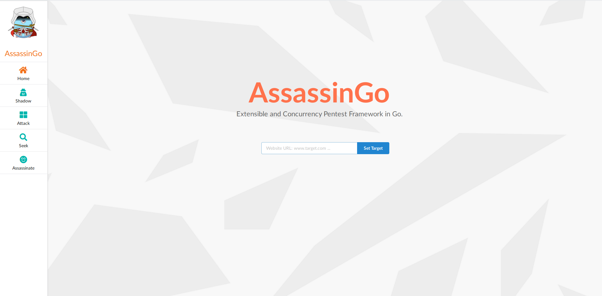

# AssassinGo

AssassinGo is an extensible and concurrency information gathering and vulnerability scanning framework, with WebSocket based Web GUI .

Just for learn.

## Features

- [x] Retrieve Server and Powered by Headers
- [x] Detect CMS Version
- [x] Honeypot Detect
- [x] Port Scan
- [x] Trace Route and Mark on Google Map
- [ ] Subdomain Scan
- [x] Dir Scan and Site Map
- [x] Whois Lookup
- [x] Crawl the Paramed URLs
- [x] Basic SQLi Check
- [x] Basic XSS Check
- [x] Intruder
- [x] Seek Targets by Search Engine
- [x] POC Interface
- [x] Web GUI(using WebSocket)

## API

### AJAX

Path | Method | Func | Params | Return
----- | ----- | ----- | ----- | -----
/api/assassin | POST | set a target | target=xxx | nil
/api/assassin-dad | POST | set targets | targets=t1,t2... | nil
/api/info/basic | GET | get ip and webserver | nil | {data:{"ip": "192.168.1.1", "webserver": "nginx"}}
/api/info/cms | GET | detect cms | nil | {data:{"cms": "wordpress"}}
/api/info/honeypot | GET | get ip and webserver | nil | {data:{"score": "0.3"}}
/api/info/whois | GET | whois | nil | {data:{"domain":"example.com","registrar_name":"alibaba", "admin_name":"xiaoming", "admin_email":"a@qq.com", "admin_phone":"+86.12312345678", "created_date":"2016-07-28T12:57:53.0Z","expiration_date":"2018-07-28T12:57:53.0Z", "ns":"dns9.hichina.com", "state":"clienttransferprohibited"}}
/api/poc | GET | get poc list | nil | {data:{"poc_list":["drupal-rce","seacms-v654-rce"]}}
/api/poc/:poc | GET | run the specified poc | nil | {data:{"exploitable_host": "example.com"}}

### WebSocket

Path | Func | Params | Return
----- | ----- | ----- | -----
/ws/info/port | ports scan | {method:"tcp"/"syn"} | {"port": "80", "service": "http"}
/ws/info/tracert | trace route and mark on google map | nil | {"ttl": 1, "addr": 192.168.1.1, "elapsed_time": 22720440, "country": China, "lat": 34.2583,"long": 116.1614}
/ws/info/dirb | brute force dir | {"gort_count":20, "dict":"php"}; {"stop":1} | {"path": "admin.php", "resp_status": 200, "resp_len": 110}
/ws/attack/crawl | crawl paramed urls | {"max_depth": 4} | {"url": "example.com/?id=1"}
/ws/attack/sqli | check sqli | nil | {"sqli_url": "example.com/?id=1}
/ws/attack/xss | check xss | nil | {"xss_url": "example.com/?id=1}
/ws/attaclintrude | brute force | {"header": "GET / HTTP/1.1 ...", "payload": "p1,p2...", "gort_count": "10"}; {"stop":1}| {"payload": 1, "resp_status": 200, "resp_len": 110}
/ws/seek | seek targets | {"query": "biu", "se": "bing/google", "max_page": 10} | {"urls": urls}
/ws/poc/:poc | run poc | {gort_count:10} | {"exploitable_host": "example.com"}

[Example Testing JS file](./web/static/api-test.js)

Remember set the target(s) first.

## State

developing...

## Demo

## License

MIT